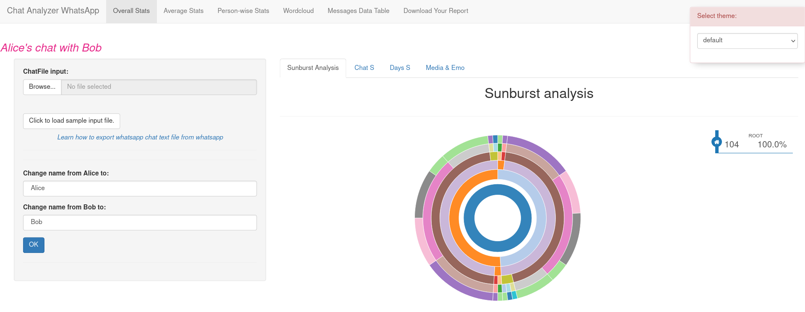
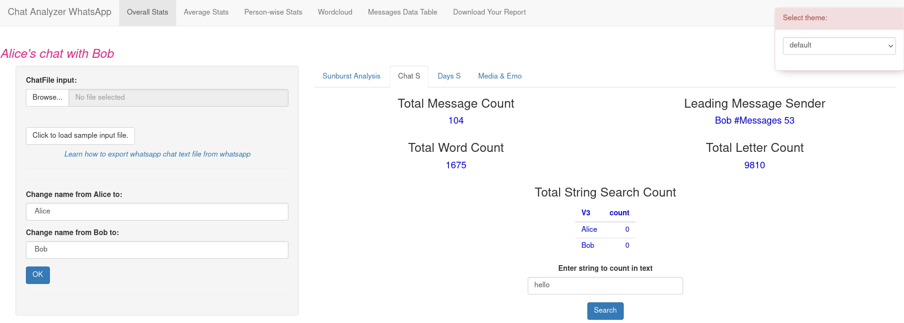
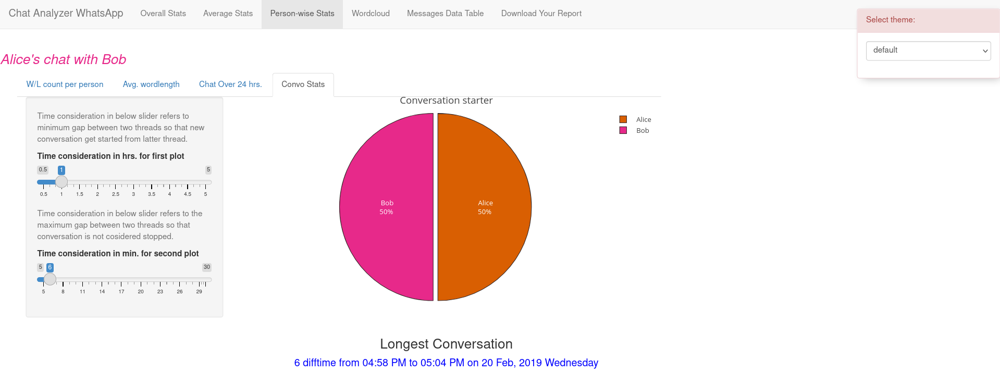
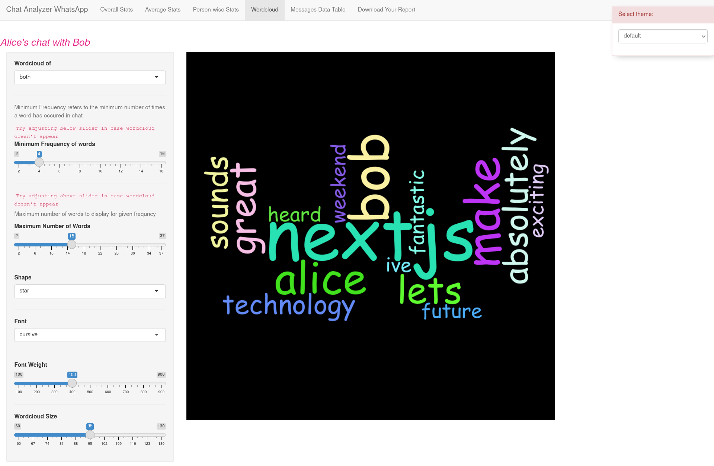

Analyze your WhatsApp conversation using R shiny app






## Install packages

```r
install.packages(
    c(
        "plotly",
        "lubridate",
        "RColorBrewer",
        "shinythemes",
        "pander",
        "shiny",
        "wordcloud2",
        "sunburstR",
        "dplyr",
        "stringr",
        "tidyr",
        "memoise",
        "tm",
        "wordcloud2"
    ) 
)```

# Run the app

```bash
Rscript -e "shiny::runApp(port=3000)"
```

Your server must be up.

open -> [http://localhost:3000](http://localhost:3000)

Follow the on screen instructions.
